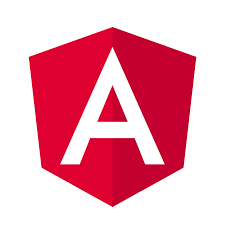
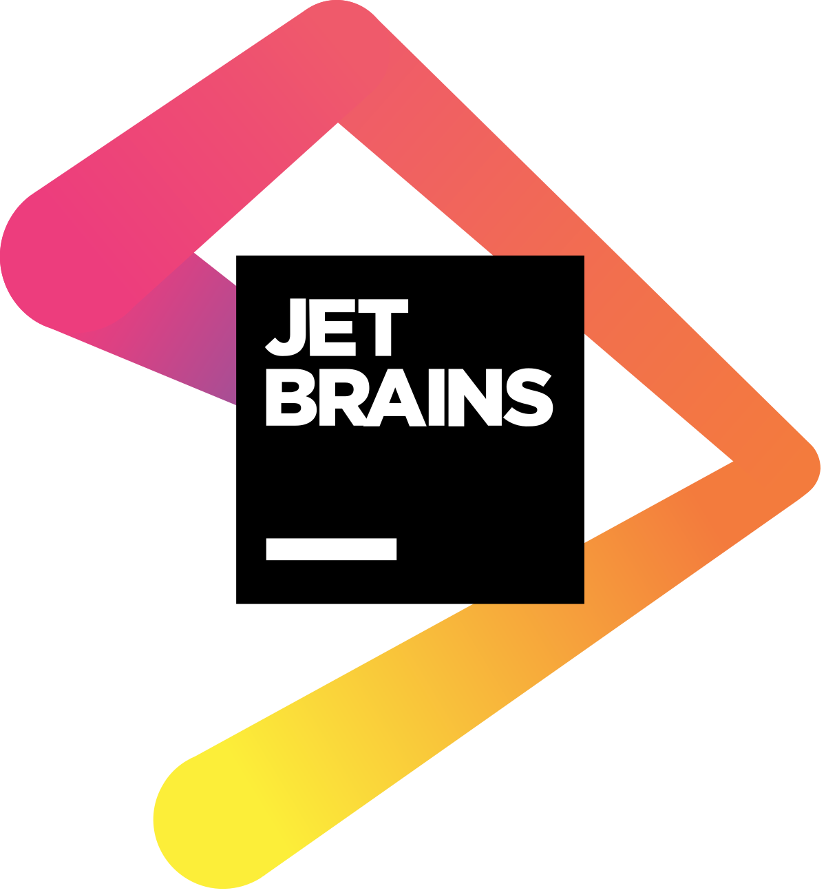
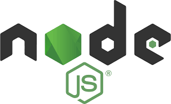
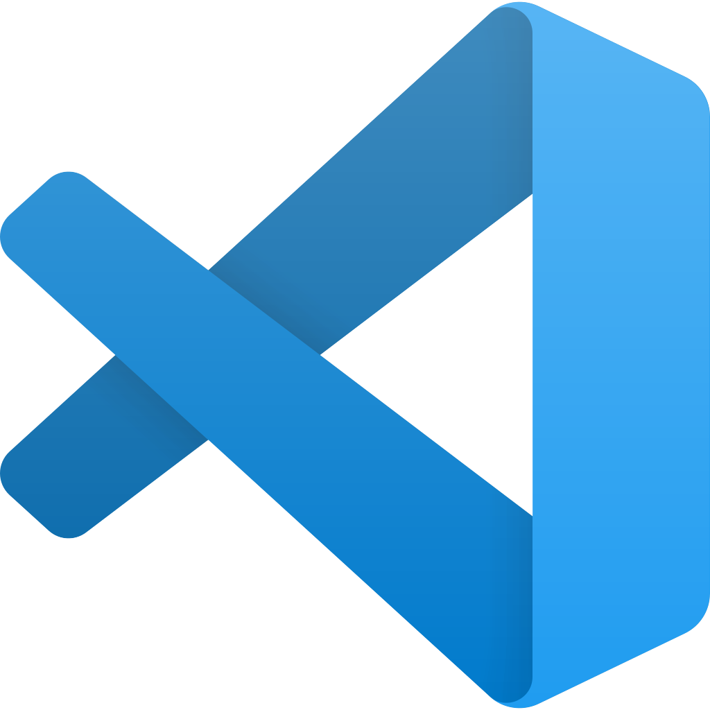

<h1 align="center">Hi 👋, I'm Alessio Tudisco a.k.a LightDestory</h1>

    
    
    
    
    
    
    

    

I am currently a Computer Science student at the University of Study of Catania. I am a Developer, on both Desktop, Web and Mobile environments, a Junior SysAdmin, a Gamer and a Manga/Anime addicted :) 

## 📈 About me (GitHub's statistics)

Do you like numbers and charts? Let's see some then:

 
  
📊 Profile's stats

   
    
  

 
  
⌨️ Most used languages

   
  
  

    

 
  
💻 My workstation

   
    

        My current workstation is a laptop, a gaming laptop (*coff *coff). Due to my studies I usually travel a lot so a desktop pc was not a viable solution :(
    

        <ul>
            <li><b>Model:</b> <i>MSI GE75 10SFS</i></li>
            <li><b>CPU:</b> <i>i7-10875H (8 cores / 16 threads)</i></li>
            <li><b>GPU:</b> <i>Intel UHD 630 / RTX 2070 Super</i></li>
            <li><b>RAM:</b> <i>32GB DDR4 3200MHZ (CL16)</i></li>
            <li><b>Operation System:</b> <i>Windows 10 + WSL2 <3 </i></li>
        </ul>
    

 
  
⚡ Some used tools

   
  

  
  
  
  
  
  
  
  
  
  

  

  Visit my website for more specific information!
  

  
🏆 My trophies

   
  
  

----

